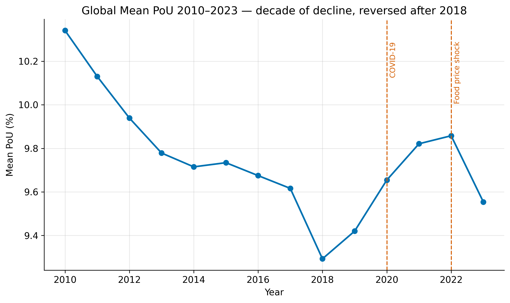
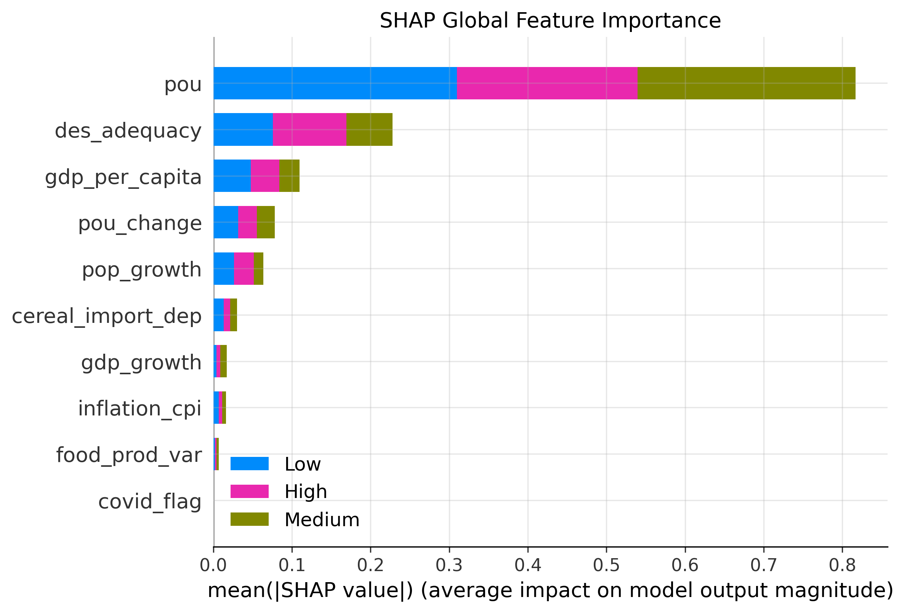
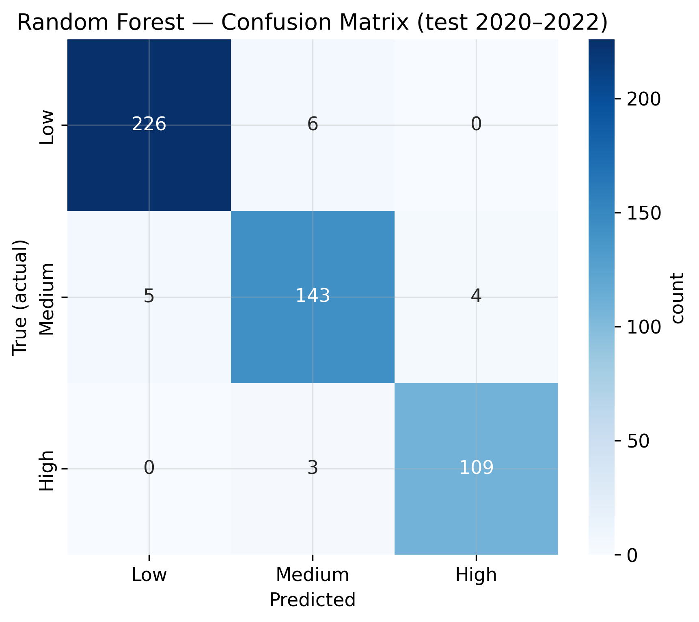
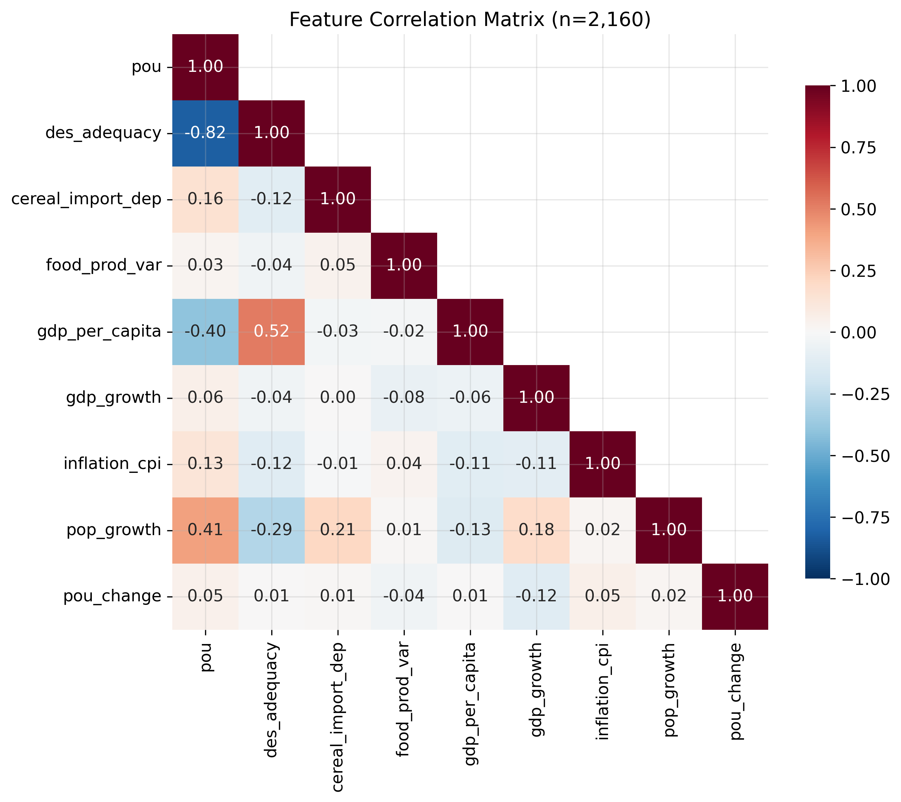

<div align="center">

# 🌾 FoodWatch

### An Explainable Early-Warning System for National Food-Security Risk

Predicting where national hunger is heading — from open UN & World Bank data, with machine learning you can actually understand.

[](https://ssettlynn.github.io/foodwatch/)


</div>

---

## Overview

**FoodWatch** turns open socioeconomic data into a forward-looking signal. From the same signals it answers
**three prediction tasks** — a country's food-security **risk tier** (Low / Medium / High), its exact
**hunger level** (%), and its **risk direction** (improving / stable / worsening) — one *and* five years
ahead. It also forecasts the future value of **five indicators** (hunger, income, inflation, food supply,
population growth), explains *why* with SHAP, and surfaces hidden condition-patterns with association-rule
mining — all in an interactive, zero-backend web app.

> Built as an academic **Data Mining** course project (2026). 100% open data. The entire site is static
> HTML/CSS/JS — the trained model's parameters are exported to JSON and evaluated **in the browser**.

## ✨ Features

| Page | What it does |
|---|---|
| 🗺️ **World & Patterns** | Animated choropleth of 14 years of undernourishment, a **2028-forecast map layer**, and the four big patterns behind global hunger |
| 📖 **Country Story** | Auto-written summaries and trend-vs-region charts; pick any indicator to see its **aligned 2024 forecast + 2028 outlook** with an honest reliability caveat |
| 🔮 **Forecast** | A **1-year / 5-year horizon toggle** (three switchable models for next year, long-horizon model for 2028), per-country confidence, per-country **indicator forecast tiles**, CSV export |
| 🧪 **Model Lab** | The **three prediction tasks**, accuracy by horizon, overfitting diagnosis, SHAP feature importance, and mined association rules |
| 🎛️ **What-If Lab** | Two live models in the browser — drag sliders and watch a country's **2024 *and* 2028** risk respond, plus its indicator forecasts |
| 📚 **Learn** | Methodology, official sources, UN/FAO videos, and an honest FAQ |

## 📊 Results

Models are evaluated on a **chronological hold-out test set** (data never seen during training).

| Model | Macro-F1 (1-yr) | Macro-F1 (5-yr) |
|---|:---:|:---:|
| Persistence baseline | 0.957 | 0.834 |
| Logistic Regression | 0.934 | 0.811 |
| Decision Tree | 0.927 | 0.765 |
| **Random Forest** | **0.958** | **0.831** |

**Headline finding:** across every model and both horizons, **no high-risk country was ever misclassified
as low-risk** — the worst possible error for an early-warning system never occurred on the test data.

<table>
<tr>
<td width="50%"></td>
<td width="50%"></td>
</tr>
<tr>
<td align="center"><sub>A decade of progress, reversed by two shocks (notebook 04)</sub></td>
<td align="center"><sub>What drives risk — and how it shifts with horizon (notebook 07)</sub></td>
</tr>
<tr>
<td width="50%"></td>
<td width="50%"></td>
</tr>
<tr>
<td align="center"><sub>Zero High→Low errors on both horizons (notebook 06)</sub></td>
<td align="center"><sub>Which signals move with hunger (notebook 04)</sub></td>
</tr>
</table>

**Leakage prevention:** chronological train/validation/test split · GroupKFold by country for tuning ·
all preprocessing inside scikit-learn Pipelines (fit on train only).

### Three prediction tasks (next year)

| Task | Type | Metric | Score | Baseline |
|---|---|:---:|:---:|:---:|
| **Risk tier** | Classification (3-class) | macro-F1 | **0.958** | 0.957 |
| **Hunger level** | Regression | MAE (pp) | **0.49** | 0.52 |
| **Risk direction** | Classification (3-class) | macro-F1 | **0.625** | acc 0.725 |

Predicting the *level* is easy (hunger is autocorrelated); predicting the *direction of change* is the genuinely
hard early-warning question — and we report it honestly.

### Multi-indicator forecasting — where prediction has limits

We forecast the future value of five indicators and measure test-set R². The result draws an **honest boundary**:

| Indicator | 1-yr R² | 5-yr R² | |
|---|:---:|:---:|---|
| Hunger level, Income, Food supply | 0.97–0.99 | 0.87–0.93 | structural → reliable |
| Population growth | 0.40 | 0.55 | moderate |
| **Inflation** | 0.55 | **−0.16** | shock-driven → **5-yr unpredictable** |

Inflation's negative 5-year R² means the model cannot beat a naive "no change" guess — a deliberate,
documented limit on what forecasting can claim.

## 🗂️ Data

| Source | Indicators used |
|---|---|
| **[FAOSTAT](https://www.fao.org/faostat/en/#data/FS)** — Suite of Food Security Indicators | Prevalence of undernourishment (SDG 2.1.1), dietary energy supply adequacy, cereal import dependency, food supply variability |
| **[World Bank WDI](https://data.worldbank.org)** | GDP per capita, GDP growth, inflation (CPI), population growth |

**Panel:** 182 countries × 14 years (2010–2023) · **Target tiers:** Low (<5%), Medium (5–15%), High (≥15%) — FAO severity bands. No API keys — official bulk CSV downloads only.

## 🚀 Run locally

```bash
git clone https://github.com/ssettlynn/foodwatch.git
cd foodwatch
python3 -m http.server 8000
# then open http://localhost:8000
```

Or just double-click `index.html` — the site has zero dependencies beyond a browser.

## 🌐 Live site

Deployed with GitHub Pages from this repository (`main` / root):
**https://ssettlynn.github.io/foodwatch/**

## 🧱 Tech stack

`Python` · `pandas` · `scikit-learn` · `SHAP` · `mlxtend` (Apriori) · `Plotly.js` · vanilla `HTML/CSS/JS` · GitHub Pages

## 📁 Project structure

```
foodwatch/
├── index.html                 # Home
├── explore.html               # World map (+2028 layer) + six EDA patterns
├── country.html               # Country stories + indicator-aligned 2024/2028 outlook
├── forecast.html              # Horizon toggle, 163-country table, indicator tiles
├── modellab.html              # Three tasks, metrics, overfitting, SHAP, rules
├── lab.html                   # In-browser what-if simulator (2024 + 2028)
├── learn.html                 # Methodology, sources, FAQ
├── style.css / fw.js          # Shared design system + JS (nav, icons, charts theme)
├── foodwatch_data.js          # Generated: data + model parameters (15 keys)
├── prepare_dashboard_data.py  # Regenerates foodwatch_data.js from models + CSVs
├── plotly.min.js              # Charting library (vendored, offline)
├── notebooks/FW.ipynb         # Full KDD pipeline (01 collect → 08 forecasting), run on Colab
├── data/processed/            # Master panel + model-ready datasets (5 CSVs + metrics)
├── models/                    # Trained classifiers (LogReg / Tree / RF × 2 horizons)
├── reports/                   # Figures + evaluation tables from the notebook
└── assets/                    # Hand-crafted SVG artwork + pipeline figures
```

## 🔁 Reproduce the pipeline

1. Open `notebooks/FW.ipynb` in Google Colab and run top-to-bottom (sections 01–08).
   It downloads the raw FAOSTAT / World Bank CSVs, builds the datasets in `data/processed/`,
   trains the models in `models/`, and saves every figure.
2. Regenerate the site data: `pip install -r requirements.txt && python3 prepare_dashboard_data.py`
   → rewrites `foodwatch_data.js` (~0.3 MB). The site itself needs no build step.


## 🔬 Methodology

**KDD pipeline:** FAOSTAT + World Bank CSV → ISO3 standardisation & merge → country-wise interpolation
(gap ≤ 2 yr, flagged) → feature engineering (hunger momentum, COVID flag, **lag targets** `shift(-1)` &
`shift(-5)`, plus tier/value/direction targets) → EDA (14 charts) + **Apriori** association mining →
3 classifiers × 2 horizons with a documented tuning journey → chronological test evaluation (overfitting,
threshold tuning, bootstrap CI) → **SHAP** explainability → **multi-indicator regression forecasting**
(notebook 08 — five indicators × two horizons) → this site.

The model parameters are baked into `foodwatch_data.js` by `prepare_dashboard_data.py`; the What-If Lab
runs a Logistic Regression **live in the browser** (softmax in JS, verified to match scikit-learn to 6 decimals).

## 📄 License

[MIT](LICENSE) · Data © FAO / World Bank under their respective open-data terms.

<div align="center">
<sub>Academic Data Mining project · Soe Sett Lynn · 2026 · Open data · Built to be understood, not just accurate.</sub>
</div>
